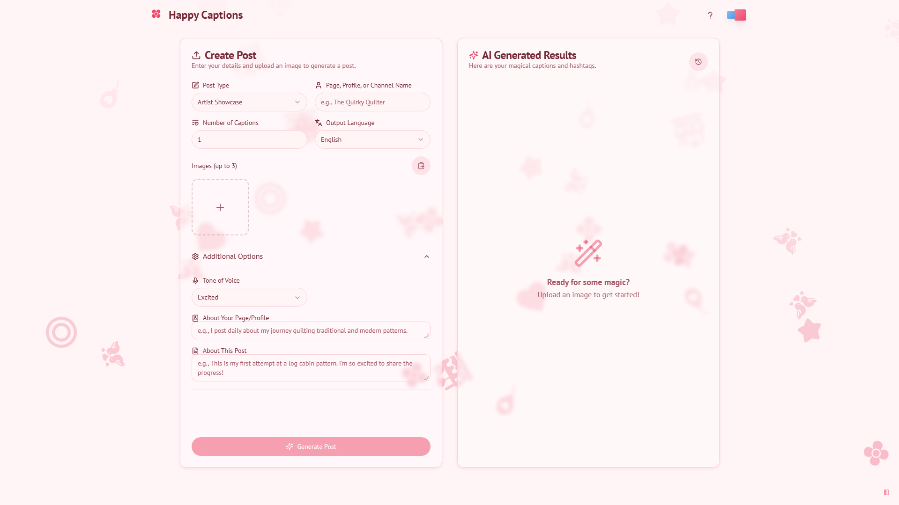
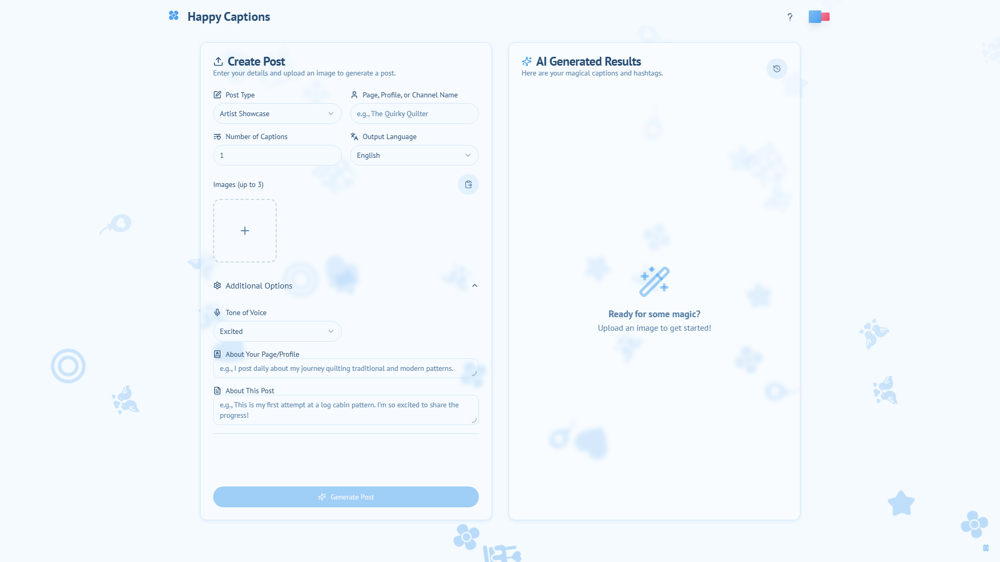

# HappyCaptions ✨

HappyCaptions is a modern, AI-powered social media assistant designed to help you create engaging content effortlessly. Simply upload an image, provide some context, and let HappyCaptions generate captivating captions and relevant hashtags tailored to your brand's voice and style.





---

## 🌟 Features

-   **AI-Powered Content Generation**: Leverages Google's Gemini models via Genkit to create high-quality social media posts.
-   **Image-First Workflow**: Upload an image to inspire the AI's creative process.
-   **Customizable Context**: Fine-tune the AI's output by providing details like:
    -   Post Type (e.g., Sale, Poem, Showcase)
    -   Tone of Voice (e.g., Witty, Professional, Funny)
    -   Page/Profile Information
    -   Specific details about the post.
-   **Multiple Variations**: Generate several caption options to choose from.
-   **Smart Hashtags**: Get a list of SEO-optimized hashtags for your post.
-   **Multi-Language Support**: Currently supports English, Bangla, and Banglish.
-   **Post History**: Your generated posts are automatically saved to local storage for easy access later.
-   **Sleek & Responsive UI**: A beautiful and intuitive interface built with ShadCN UI and Tailwind CSS that works seamlessly on desktop, tablet, and mobile devices.
-   **Copy & Share**: Easily copy captions and hashtags or use the native share API.

---

## 🛠️ Tech Stack

-   **Framework**: [Next.js](https://nextjs.org/) (using the App Router)
-   **Generative AI**: [Google's Gemini models](https://deepmind.google/technologies/gemini/)
-   **AI Orchestration**: [Genkit](https://firebase.google.com/docs/genkit)
-   **Styling**: [Tailwind CSS](https://tailwindcss.com/)
-   **UI Components**: [ShadCN UI](https://ui.shadcn.com/)
-   **Language**: [TypeScript](https://www.typescriptlang.org/)

---

## 🚀 Getting Started

Follow these instructions to get a copy of the project up and running on your local machine for development and testing purposes.

### Prerequisites

-   [Node.js](https://nodejs.org/en) (v20 or later recommended)
-   `npm` or your favorite package manager
-   A Google AI API Key. You can get one from [Google AI Studio](https://aistudio.google.com/app/apikey).

### Installation

1.  **Clone the repository:**
    ```bash
    git clone <repository-url>
    cd <repository-directory>
    ```

2.  **Install dependencies:**
    ```bash
    npm install
    ```

3.  **Set up environment variables:**
    Create a file named `.env` in the root of your project and add your Google AI API key:
    ```env
    GEMINI_API_KEY="YOUR_API_KEY_HERE"
    ```

4.  **Run the development server:**
    The application runs on two development servers: one for the Next.js frontend and one for the Genkit flows.

    -   **Terminal 1: Start the Next.js app:**
        ```bash
        npm run dev
        ```
        This will start the frontend on [http://localhost:9002](http://localhost:9002).

    -   **Terminal 2: Start the Genkit flows:**
        ```bash
        npm run genkit:dev
        ```
        This will start the Genkit development server, which the Next.js app communicates with for AI features.

You should now be able to access the application in your browser and start generating posts!
